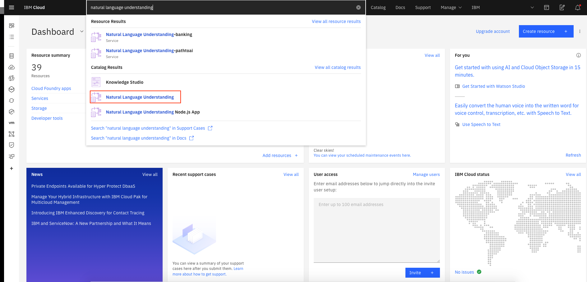
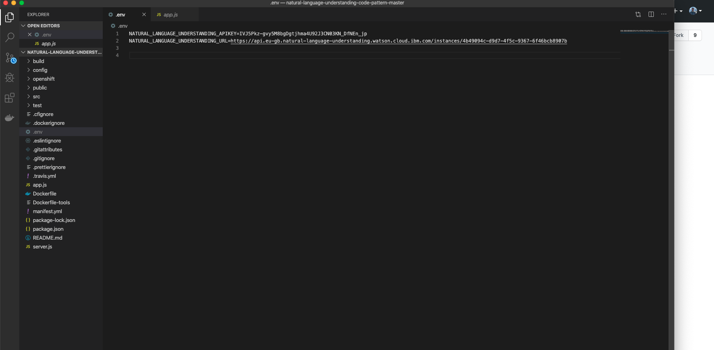
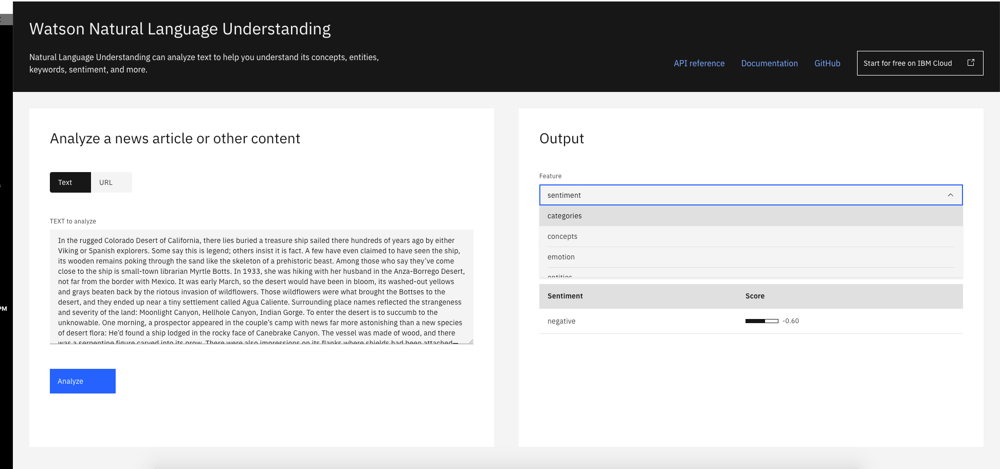

<h1 align="center" style="border-bottom: none;">🔎 Natural Language Understanding  </h1>
<h3 align="center">Natural Language Understanding is a collection of APIs that offer text analysis through natural language processing. This set of APIs can analyze text to help you understand its concepts, entities, keywords, sentiment, and more. Additionally, you can create a custom model for some APIs to get specific results that are tailored to your domain.</h3>
<p align="center">
  <a href="http://travis-ci.org/watson-developer-cloud/natural-language-understanding-code-pattern">
    
  </a>
  <a href="#badge">
    
  </a>
</p>
</p>

### Flow

<p align="center">
  
</p>

1. User sends messages to the application.
1. The application sends the user message to IBM Watson Natural Language Understanding service.
1. Watson Natural Language Understanding processes the text or url and extract features such us keywords, concepts, categories. The service can be provisioned on either IBM Cloud.


### Step 1 : Sign-up for IBM Cloud Platform

[http://ibm.biz/aipath1](http://ibm.biz/aipath1)


### Step 2 : Login into your IBM account and search for "Natural Language Understanding"

IBM Cloud Login-link: [http://ibm.biz/aipath1](http://ibm.biz/aipath1)




### Step 3 : Then select "Lite Pricing Plan" 


### Step 4 : Let's setup your Service

1. Select region "London".


2. Service name: "Natural Language Understanding" (You can use any unique name)
3. Once everything is done click "Create"


### Step 5 : Check if your Service is active


### Step 6 : It's time to copy credentials in our application


<details>
<summary>Configure the authentication manually</summary>

1.  In the application folder, copy the _.env.example_ file and create a file called _.env_

    ```
    cp .env.example .env
    ```

2.  Open the _.env_ file and add the service credentials depending on your environment.

    Example _.env_ file that configures the `apikey` and `url` for a Natural Language Understanding service instance hosted in the US East region:

    ```
    NATURAL_LANGUAGE_UNDERSTANDING_IAM_APIKEY=<API Key>
    NATURAL_LANGUAGE_UNDERSTANDING_URL=https://api.us-east.natural-language-understanding.watson.cloud.ibm.com/
    ```



## Running locally

1. Install the dependencies

   ```
   npm install
   ```

2. Build the application

   ```
   npm run build
   ```

3. Run the application

   ```
   npm run dev
   ```

4. View the application in a browser at `localhost:5000`



